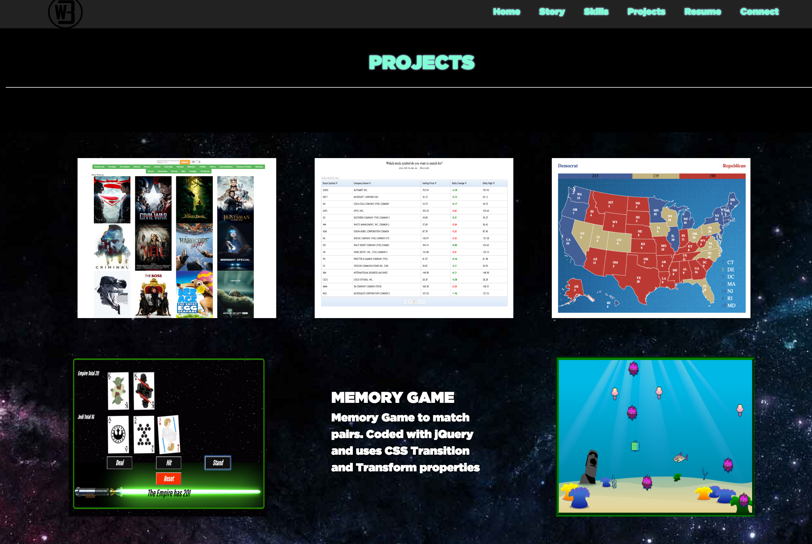

## Building a Portfolio Website with HTML, CSS, jQuery
###If you're reading this, Thanks for stalking My Super Awesome site!
###Saving a version here on gitHub to use as base for pushing out to my host on AWS.

<!---->
###Created Layout With BootStrap 
#####Home, Story, Deep Thoughts, Projects, and Connect Sections
#####Added Black Headers Before Each Section
###Styled Each Section using SCSS/CSS
#####Implemented sweet page-load sequence using CSS animations
#####Implemented wow animations on content of individual sections
###Updated Projects Sections
#####Added projects with links and css hover animations into Projects section
###Implemented php mailer in AWS
#####In connect section used a Php Mailer.
#####Dowloaded php mailer inside Ubuntu AWS server
###Deployed Project To AWS
